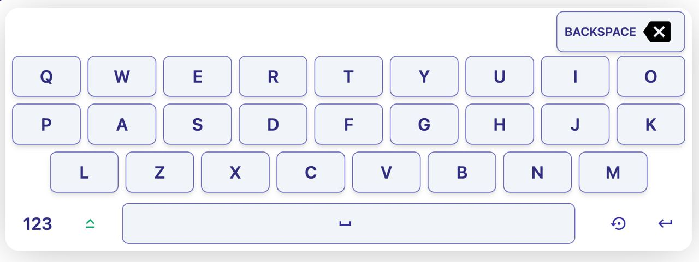

# On-Screen Keyboard App

This is an example application featuring a virtual on-screen keyboard, developed using React, TailwindCSS and DaisyUI.


[](./LICENSE)



<!-- <hr> -->

With this application, users can input text using the virtual keyboard, use Caps Lock, Backspace, Space, and Enter keys.

## Installation:

[](https://www.npmjs.com/package/@autosys/react-mui-keyboard)

Install with npm:

`npm install @autosys/react-base-keyboard`

Install with yarn:

`yarn add @autosys/react-base-keyboard`

Install with pnpm:

`pnpm add @autosys/react-base-keyboard`

## Technologies

- React: JavaScript library for building user interfaces.
- TailwindCSS: CSS framework.
- DaisyUI: component library for Tailwind CSS.

## License

This project is licensed under the MIT License - see the [LICENSE](LICENSE) file for details.

## Example Usage:

1. Wrap your application with the `MuiKeyboardProvider`:

```tsx
import React from 'react';
import ReactDOM from 'react-dom/client';
import App from './App';
import reportWebVitals from './reportWebVitals';
import { MuiKeyboardProvider } from './context/MuiKeyboardProvider';
import { numbers, englishLetters } from './Keyboards';
import './index.css';

const root = ReactDOM.createRoot(document.getElementById('root') as HTMLElement);
root.render(
  <MuiKeyboardProvider
    letters={englishLetters}
    numbers={numbers}
    reverseButton
    betweenButtons={'10px'}
    functionalButtonStyle={{
      backButtonStyle: {
        className:
          'bg-slate-100 hover:bg-indigo-300 uppercase text-indigo-900 btn-outline border-indigo-800/70 shadow-md justify-end w-[150px] mr-2',
      },
      spaceButtonStyle: {
        className:
          'bg-slate-100 hover:bg-indigo-300 btn-outline border-indigo-800/70 text-indigo-900 text-xl m-2 w-full',
      },
      letterButtonStyle: {
        className: 'text-indigo-900 text-xl btn-ghost',
      },
      reverseButtonStyle: {
        className: 'text-indigo-900 text-xl btn-ghost',
      },
      enterButtonStyle: {
        className: 'text-indigo-900 text-xl btn-ghost',
      },
      capsButtonStyle: { className: 'btn-ghost' },
    }}
    numberButtonStyle={{
      className:
        'bg-slate-100 hover:bg-indigo-300 btn-outline border-indigo-800/70 text-indigo-900 text-xl m-1 w-20',
    }}
    textButtonStyle={{
      className:
        'bg-slate-100 hover:bg-indigo-300 btn-outline border-indigo-800/70 shadow-md text-indigo-900 text-xl m-1 w-16',
    }}
  >
    <App />
  </MuiKeyboardProvider>,
);

reportWebVitals();
```

2. Then yo may use the `useMuiKeyboard` hook in any another component to access the input value and setter from the context.

```tsx
// App.tsx
import React from 'react';
import { useMuiKeyboard } from './context/MuiKeyboardProvider';

const App = () => {
  const { inputValue, keyBoard, keyboardFeature } = useMuiKeyboard();
  return (
    <div>
      <input
        type="text"
        className="input input-bordered input-primary w-full max-w-xs"
        value={inputValue}
      />
      {keyBoard}
      <button className="btn" onClick={() => keyboardFeature({ openKeyboard: true })}>
        {'open'}
      </button>
    </div>
  );
};

export default App;
```

- `{keyBoard}` is the keyboard itself
- If you want to reset the inputValue, but don't want to do it with a button on the keyboard, you can use any other button with `onClick={() => keyboardFeature({ resetText: true })}`
- To open the keyboard, use `onClick={() => keyboardFeature({ openKeyboard: true })}`, to close `onClick={() => keyboardFeature({ openKeyboard: false })}`

### Properties

| Name                    | Type               | Description                                                  |
| ----------------------- | ------------------ | ------------------------------------------------------------ |
| `numbers*`              | `string[]`         | Array of number and special characters for keyboard buttons. |
| `letters`               | `string[]`         | Array of letters characters for keyboard buttons.            |
| `reverseButton*`        | `boolean`          | Text reset button.                                           |
| `betweenButtons*`       | `string \| number` | Distance between buttons.                                    |
| `functionalButtonStyle` | `object`           | Object containing styles for functional buttons.             |
| `.backButtonStyle*`     | `object`           | Styles for the back button including className.              |
| `..className`           | `string`           | ClassName for the back button.                               |
| `.spaceButtonStyle*`    | `object`           | Styles for space button including className.                 |
| `..className`           | `string`           | ClassName for the space button.                              |
| `.letterButtonStyle*`   | `object`           | Styles for letter buttons including className.               |
| `..className`           | `string`           | ClassName for the letter buttons.                            |
| `.reverseButtonStyle*`  | `object`           | Styles for reverse button including className.               |
| `..className`           | `string`           | ClassName for the reverse button.                            |
| `.enterButtonStyle*`    | `object`           | Styles for enter button including className.                 |
| `..className`           | `string`           | ClassName for the enter button.                              |
| `.capsButtonStyle*`     | `object`           | Styles for caps button including className.                  |
| `..className`           | `string`           | ClassName for the caps button.                               |
| `numberButtonStyle*`    | `object`           | Styles for number buttons including className.               |
| `.className`            | `string`           | ClassName for the number buttons.                            |
| `textButtonStyle`       | `object`           | Styles for text buttons including className.                 |
| `.className`            | `string`           | ClassName for the text buttons.                              |

Props marked with \* are required.
