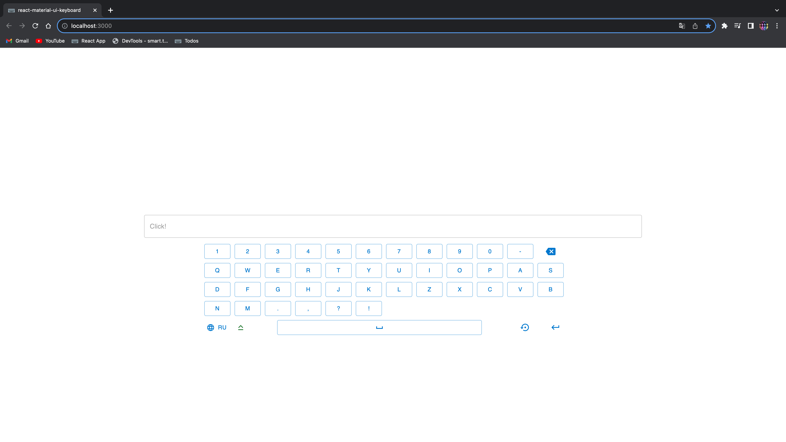

# On-Screen Keyboard App

This is an example application featuring a virtual on-screen keyboard, developed using React and Material-UI (MUI).

Read this in other languages: [Русский](README.ru.md)

<!-- 
 -->

With this application, users can input text using the virtual keyboard, select the keyboard layout language (Russian or English), use Caps Lock, Backspace, Space, and Enter keys.

## Installation

1. Clone the repository using the command:
   `git clone <repository URL>`
2. Navigate to the project folder:
   `cd on-screen-keyboard-app`
3. Install the dependencies:
   `yarn`

## Running

Start the application using the command:
`yarn start`

This will open a web application with a virtual on-screen keyboard.

## Usage

1. To input text, click on the virtual keyboard buttons or use the Caps Lock, Backspace, Space, and Enter keys.

2. To change the keyboard layout language, click on the "RU" button (Russian layout) or "EN" button (English layout).

## Technologies

- React: JavaScript library for building user interfaces.
- Material-UI (MUI): Component library for creating stylish user interfaces.

## License

This project is licensed under the MIT License - see the [LICENSE](LICENSE) file for details.
