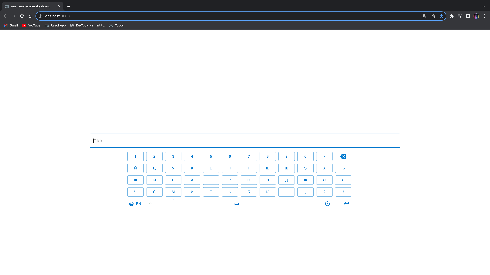

# On-Screen Keyboard App

Это пример приложения с виртуальной клавиатурой на экране, разработанное с использованием React и Material-UI (MUI).

<!-- 
 -->

С помощью этого приложения, пользователи могут вводить текст на виртуальной клавиатуре, выбирать язык раскладки клавиатуры (русский или английский), использовать клавиши Caps Lock, Backspace, пробел и Enter.

## Установка

1. Клонируйте репозиторий с помощью команды:
   `git clone <URL репозитория>`
2. Перейдите в папку проекта:
   `cd on-screen-keyboard-app`
3. Установите зависимости:
   `yarn`

## Запуск

Запустите приложение с помощью команды:
`yarn start`

После этого, откроется веб-приложение с виртуальной клавиатурой на экране.

## Использование

1. Для ввода текста, щелкните на кнопки виртуальной клавиатуры или используйте клавиши Caps Lock, Backspace, пробел и Enter.

2. Для изменения языка раскладки клавиатуры, щелкните на кнопку "RU" (русская раскладка) или "EN" (английская раскладка).

## Технологии

- React: JavaScript-библиотека для построения пользовательских интерфейсов.
- Material-UI (MUI): Библиотека компонентов для создания стильных пользовательских интерфейсов.

## Лицензия

Этот проект лицензирован под MIT License - подробности смотрите в файле [LICENSE](LICENSE).
